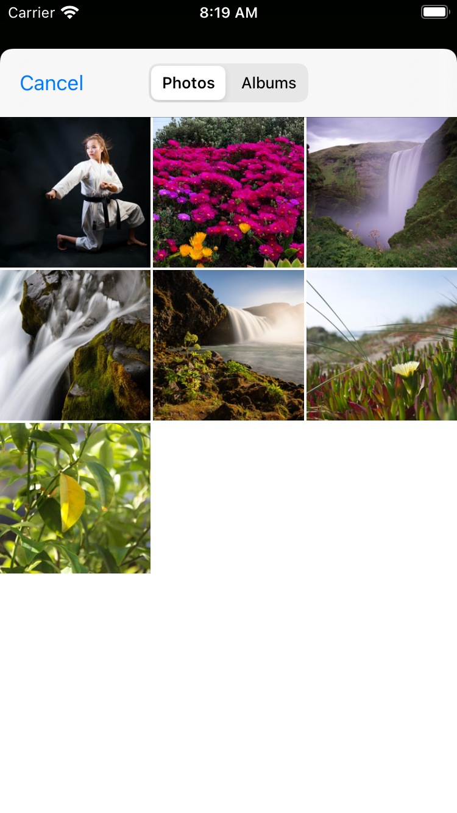
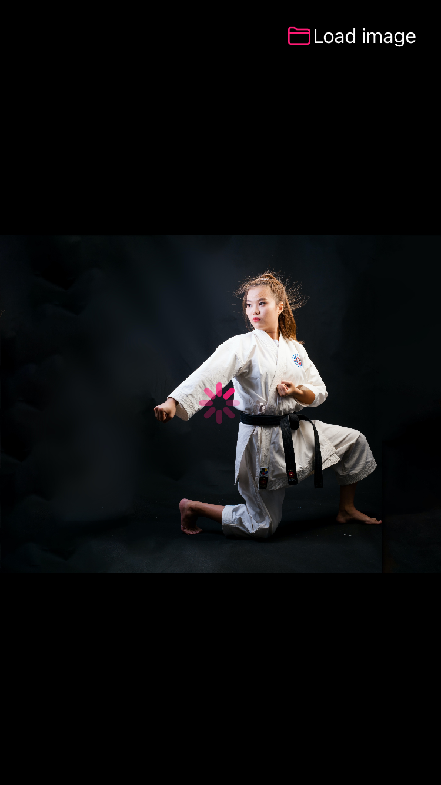
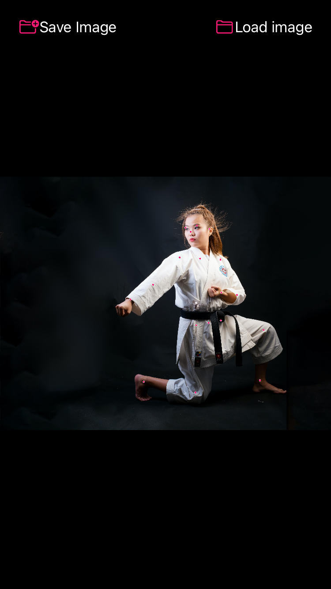
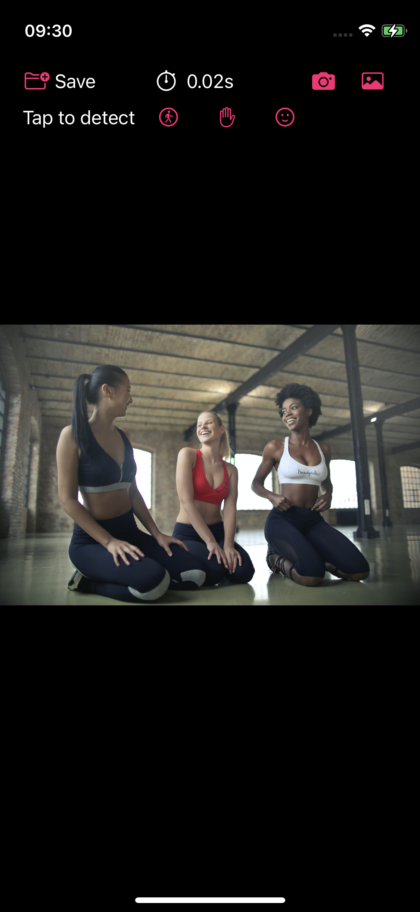
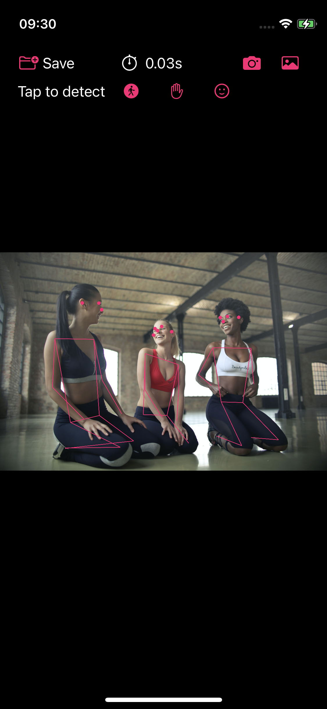
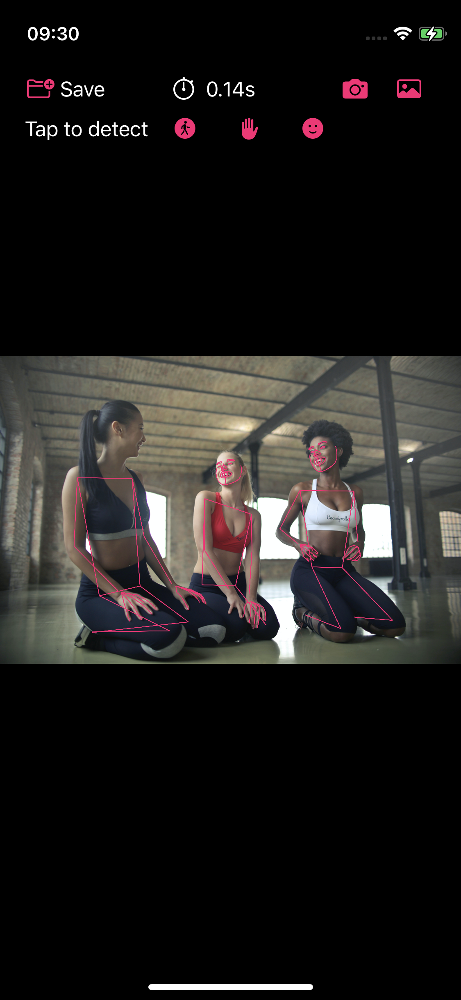

# Vision Demo Application
Application used as an example in articles on my blog https://cornerbit.tech

The list of Vision articles:

- #8 from 31.08.2021 - [Detecting body pose using Vision framework](https://cornerbit.tech/detecting-body-pose-using-vision-framework/) using application version [0.1.0](https://github.com/ktustanowski/visiondemo/releases/tag/v0.1.0)

   

Photo by [Thao Le Hoang](https://unsplash.com/@h4x0r3?utm_source=unsplash&utm_medium=referral&utm_content=creditCopyText) on [Unsplash](https://unsplash.com/s/photos/karate?utm_source=unsplash&utm_medium=referral&utm_content=creditCopyText)

- #9 from 07.09.2021 - [Detecting body pose, hand pose, and face landmarks using Vision framework](https://cornerbit.tech/detecting-body-pose-hand-pose-and-face-landmarks-using-vision-framework/) using application version [0.2.0](https://github.com/ktustanowski/visiondemo/releases/tag/v0.2.0)

   

Photo by [bruce mars](https://unsplash.com/@brucemars?utm_source=unsplash&utm_medium=referral&utm_content=creditCopyText) on [Unsplash](https://unsplash.com/s/photos/karate?utm_source=unsplash&utm_medium=referral&utm_content=creditCopyText)

- #10 from 14.09.2021 - [Barcode detection using Vision framework](https://cornerbit.tech/barcode-detection-using-vision-framework) using application version [0.3.0](https://github.com/ktustanowski/visiondemo/releases/tag/v0.3.0)
