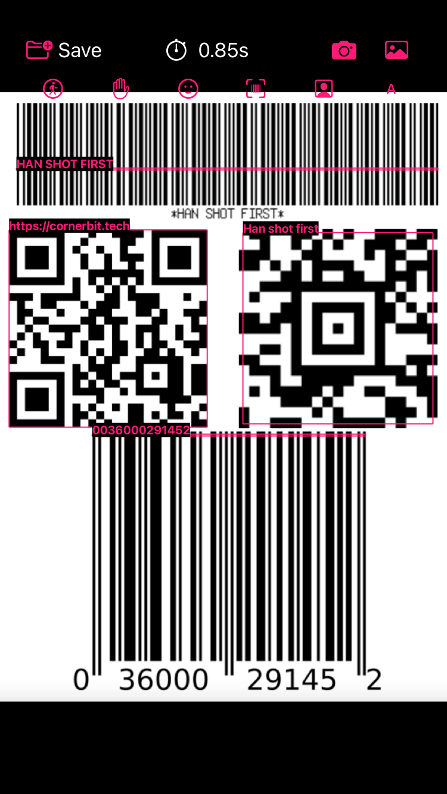
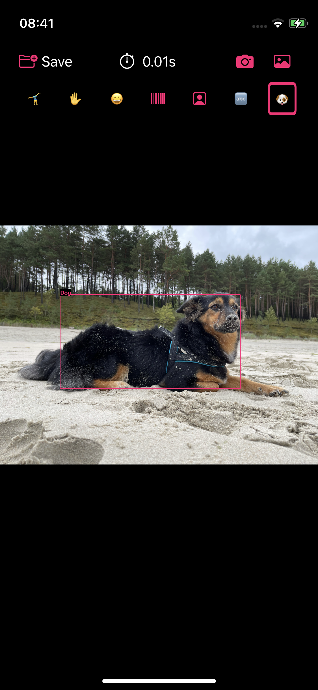
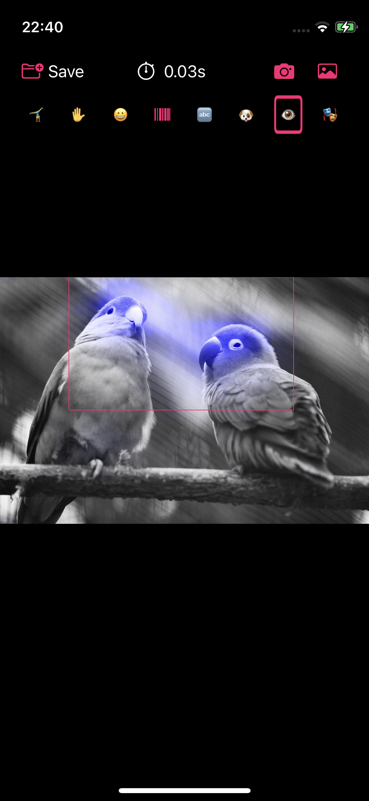
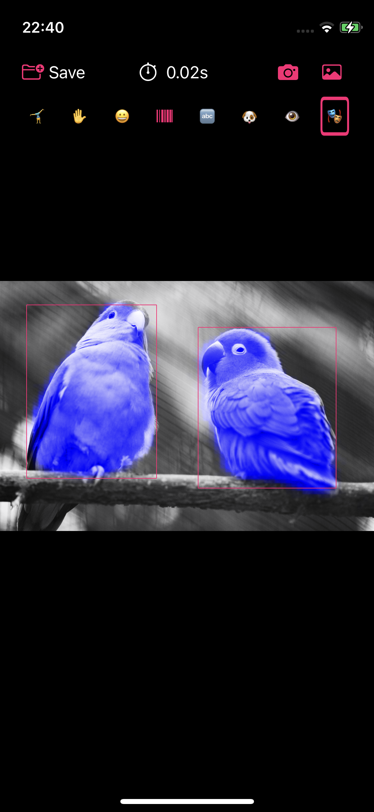
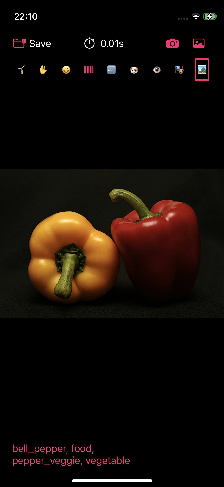
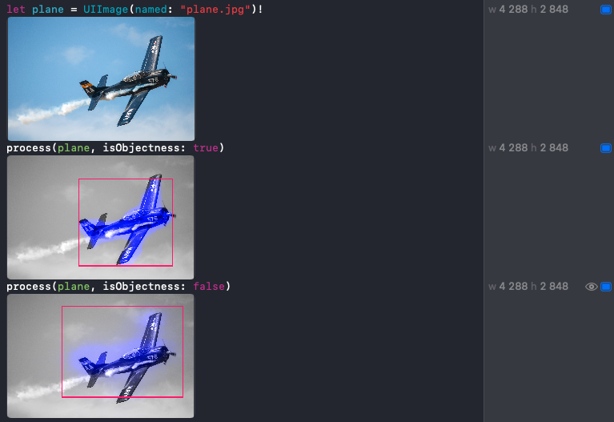

# Vision Demo Application
Application used as an example in articles on my blog https://cornerbit.tech

The list of Vision articles:

- [Detecting body pose using Vision framework](https://cornerbit.tech/detecting-body-pose-using-vision-framework/) using application version [0.1.0](https://github.com/ktustanowski/visiondemo/releases/tag/v0.1.0)

   

Photo by [Thao Le Hoang](https://unsplash.com/@h4x0r3?utm_source=unsplash&utm_medium=referral&utm_content=creditCopyText) on [Unsplash](https://unsplash.com)

- [Detecting body pose, hand pose, and face landmarks using Vision framework](https://cornerbit.tech/detecting-body-pose-hand-pose-and-face-landmarks-using-vision-framework/) using application version [0.2.0](https://github.com/ktustanowski/visiondemo/releases/tag/v0.2.0)

   

Photo by [bruce mars](https://unsplash.com/@brucemars?utm_source=unsplash&utm_medium=referral&utm_content=creditCopyText) on [Unsplash](https://unsplash.com)

- [Barcode detection using Vision framework](https://cornerbit.tech/barcode-detection-using-vision-framework) using application version [0.3.0](https://github.com/ktustanowski/visiondemo/releases/tag/v0.3.0)

- [Animals detection using the Vision framework](https://cornerbit.tech/animals-detection-using-the-vision-framework) using application version [0.4.0](https://github.com/ktustanowski/visiondemo/releases/tag/v0.4.0)

- [Saliency detection using the Vision framework](https://cornerbit.tech/saliency-detection-using-the-vision-framework) using application version [0.5.0](https://github.com/ktustanowski/visiondemo/releases/tag/v0.5.0)

 

Photo by [Jonah Pettrich](https://unsplash.com/@jonah_jpg?utm_source=unsplash&utm_medium=referral&utm_content=creditCopyText) on [Unsplash](https://unsplash.com)

- [Image classification using the Vision framework](https://cornerbit.tech/image-classification-using-the-vision-framework) using application version [0.6.0](https://github.com/ktustanowski/visiondemo/releases/tag/v0.6.0)

Photo by [Robert Lukeman](https://unsplash.com/@robertlukeman?utm_source=unsplash&utm_medium=referral&utm_content=creditCopyText) on [Unsplash](https://unsplash.com)

- [Working with the Vision framework in the playgrounds](https://cornerbit.tech/working-with-the-vision-framework-in-the-playgrounds) using application version [0.7.0](https://github.com/ktustanowski/visiondemo/releases/tag/v0.7.0)
Starting from 0.7.0 the project contains playground with example Vision requests for you to try out.  

Photo by [Lacie Slezak](https://unsplash.com/@nbb_photos) on [Unsplash](https://unsplash.com)
